# Cafe Sales — Data Preprocessing Pipeline

This document describes the end-to-end data cleaning and feature engineering pipeline applied to the **`dirty_cafe_sales.csv`** dataset. The full implementation lives in [`data_preprocessing.ipynb`](../data_preprocessing.ipynb); below we summarise the reasoning, the techniques used, and the final result.

---

## Table of Contents

1. [Dataset Overview](#1-dataset-overview)
2. [Raw Data Exploration](#2-raw-data-exploration)
3. [Missing & Dirty Value Analysis](#3-missing--dirty-value-analysis)
4. [Type Casting & Parsing](#4-type-casting--parsing)
5. [Missing Value Imputation Strategy](#5-missing-value-imputation-strategy)
6. [Duplicate Removal](#6-duplicate-removal)
7. [Outlier Detection & Capping](#7-outlier-detection--capping)
8. [Feature Engineering](#8-feature-engineering)
9. [Post-Cleaning Results & Insights](#9-post-cleaning-results--insights)
10. [Final Output](#10-final-output)

---

## 1. Dataset Overview

The raw dataset (`dirty_cafe_sales.csv`) contains **10,000 transactions** from a cafe, recorded across **9 columns**:

| Column             | Expected Type | Known Issues                           |
| ------------------ | ------------- | -------------------------------------- |
| `Transaction ID`   | string        | Unique identifier — no issues          |
| `Item`             | categorical   | ~7 % blank / `UNKNOWN`                 |
| `Quantity`         | integer       | ~3 % blank / invalid                   |
| `Price Per Unit`   | float         | ~3 % blank / invalid                   |
| `Total Spent`      | float         | `"ERROR"` / `"UNKNOWN"` string values  |
| `Payment Method`   | categorical   | `""` / `"ERROR"` / `"UNKNOWN"` (~29 %) |
| `Location`         | categorical   | `""` / `"ERROR"` / `"UNKNOWN"` (~36 %) |
| `Transaction Date` | date          | `""` / `"ERROR"` / `"UNKNOWN"` (~3 %)  |
| `Transaction Time` | time (HH:MM)  | `""` / `"ERROR"` / `"UNKNOWN"` (~5 %)  |

The dataset is intentionally "dirty" — it mixes genuine `NaN`s with sentinel strings like `"ERROR"`, `"UNKNOWN"`, `"NULL"`, and blank values spread across every column.

---

## 2. Raw Data Exploration

Before any cleaning, we perform a broad exploration to understand structure, distributions, and the scope of data quality issues.

**Why load everything as strings first?** Columns like `Total Spent` contain literal `"ERROR"` or `"UNKNOWN"` strings mixed with numbers. Loading as `dtype=str` gives full control over when and how we cast, preventing pandas from silently coercing columns to `object`.

### Monthly Transaction Volume (Raw)

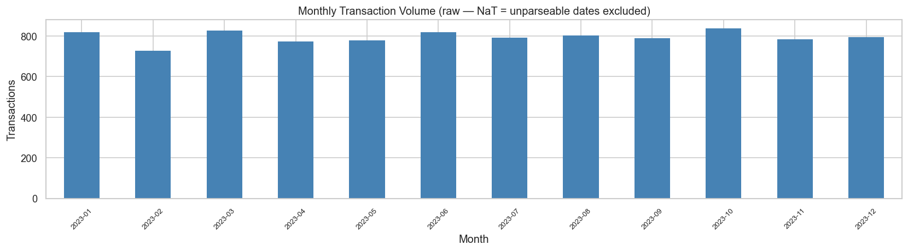

Transaction volume is relatively stable across 2023, ranging from ~730 to ~840 per month. February has the lowest count (shorter month), while October shows the highest.

### Raw Column Distributions

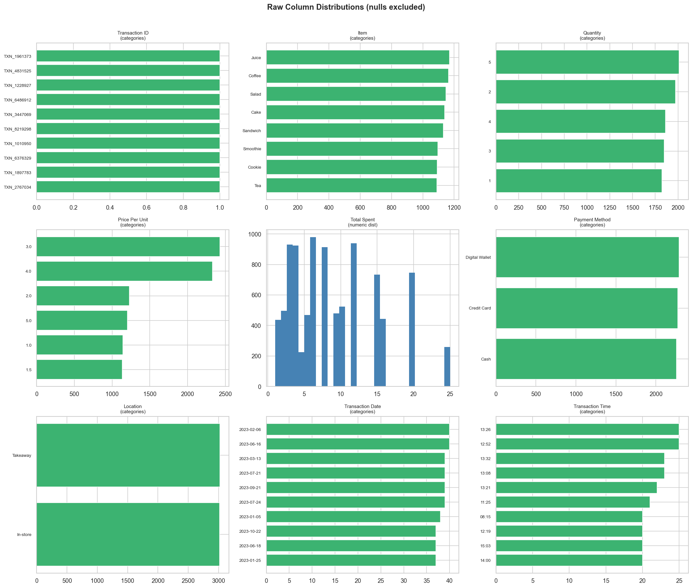

Key observations from the raw distributions:

- **Item**: 8 menu items (Juice, Coffee, Salad, Cake, Sandwich, Smoothie, Cookie, Tea) with fairly even distribution
- **Quantity**: integer values 1–5, roughly uniform
- **Price Per Unit**: discrete values (\$1.00–\$5.00), with \$3.00 being the most common
- **Total Spent**: right-skewed continuous distribution, mostly in the \$1–\$20 range with a tail up to \$25
- **Payment Method**: three methods (Cash, Credit Card, Digital Wallet), roughly equal frequency among valid entries
- **Location**: two locations (In-store, Takeaway), with Takeaway slightly more common

---

## 3. Missing & Dirty Value Analysis

The dataset uses **four different representations of "no data"**:

- Empty string `""`
- Literal `"UNKNOWN"`
- Literal `"ERROR"`
- True `NaN` (rare since we loaded as strings)

We normalize all sentinel values (`""`, `"UNKNOWN"`, `"ERROR"`, `"NULL"`, `"N/A"`, `"NAN"`, `"NONE"`) to `NaN` so pandas's standard missing-value tools work correctly.

### Missing Values After Sentinel Normalisation

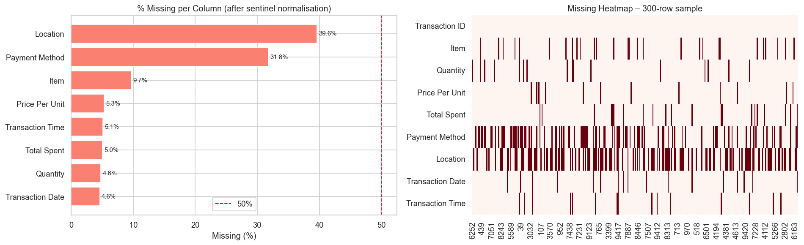

After normalisation, the missing-value landscape is:

| Column             | Missing %  |
| ------------------ | ---------- |
| **Location**       | **39.6 %** |
| **Payment Method** | **31.8 %** |
| Item               | 9.7 %      |
| Price Per Unit     | 5.3 %      |
| Transaction Time   | 5.1 %      |
| Total Spent        | 5.0 %      |
| Quantity           | 4.8 %      |
| Transaction Date   | 4.6 %      |

The **heatmap** (right panel) shows that missingness is scattered randomly across rows — there is no systematic pattern where entire rows are empty, which supports column-by-column imputation.

---

## 4. Type Casting & Parsing

After sentinel normalisation, each column is cast to its intended type:

| Column(s)                                   | Target Type         | Method                                                          |
| ------------------------------------------- | ------------------- | --------------------------------------------------------------- |
| `Quantity`, `Price Per Unit`, `Total Spent` | `float64`           | `pd.to_numeric(errors="coerce")` — invalid strings become `NaN` |
| `Transaction Date`                          | `datetime64`        | `pd.to_datetime(errors="coerce")`                               |
| `Transaction Time`                          | `datetime64` (time) | Parsed from `"HH:MM"` format; hour extracted as integer         |
| `Item`, `Payment Method`, `Location`        | `category`          | Reduces memory footprint and enables categorical operations     |

---

## 5. Missing Value Imputation Strategy

Each column receives a tailored imputation strategy based on its semantics and relationship to other columns:

| Column               | Strategy                                    | Rationale                                                                                                                                   |
| -------------------- | ------------------------------------------- | ------------------------------------------------------------------------------------------------------------------------------------------- |
| **Item**             | Mode imputation                             | Only 8 menu items; filling with the most common item is a reasonable default                                                                |
| **Quantity**         | Median imputation                           | Integer values 1–5; median is robust to mild skew                                                                                           |
| **Price Per Unit**   | Mean per Item (two-pass)                    | Each item has a near-fixed price. **Pass 1**: fill where `Item` is already known. **Pass 2**: fill remaining after `Item` itself is imputed |
| **Total Spent**      | Recalculated as `Quantity × Price Per Unit` | More accurate than imputing a raw number; recalculated twice to capture values resolved after each pass                                     |
| **Payment Method**   | Mode imputation                             | No business rule links payment method to other columns                                                                                      |
| **Location**         | Mode imputation                             | Same rationale                                                                                                                              |
| **Transaction Date** | Drop rows                                   | Dates cannot be reliably reconstructed; only ~3 % of data affected                                                                          |
| **Transaction Time** | Median hour imputation                      | ~5 % dirty; median hour preserves the realistic time distribution                                                                           |

### Why a two-pass approach for Price Per Unit?

Some rows are missing **both** `Item` and `Price Per Unit`. In pass 1, we can only fill price for rows where the item is known. After filling `Item` via mode imputation, pass 2 covers the remaining rows using the now-complete item information.

### Revenue consistency check

After all imputation, `Total Spent` is verified against `Quantity × Price Per Unit`. Any mismatched rows are corrected to ensure internal consistency.

---

## 6. Duplicate Removal

Two deduplication steps are applied:

1. **Full-row duplicates** — identical across all columns → removed
2. **Duplicate Transaction IDs** — same `Transaction ID` appearing more than once → keep first occurrence

---

## 7. Outlier Detection & Capping

We apply **IQR-based capping** on three numeric columns: `Quantity`, `Price Per Unit`, and `Total Spent`.

For each column:

- Compute $Q_1$ (25th percentile) and $Q_3$ (75th percentile)
- Calculate $IQR = Q_3 - Q_1$
- Define bounds: $[Q_1 - 1.5 \times IQR,\; Q_3 + 1.5 \times IQR]$
- Clip values outside bounds to the nearest fence

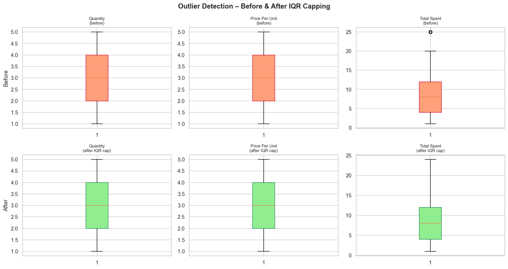

The box plots show that `Quantity` and `Price Per Unit` had no significant outliers (bounded 1–5 by design). `Total Spent` had a few extreme values above \$25 that were capped. Overall, the distributions remain intact after capping.

---

## 8. Feature Engineering

The following new columns are derived from existing data to support downstream analysis and modelling:

### Date-Derived Features

| Feature       | Source             | Description                                     |
| ------------- | ------------------ | ----------------------------------------------- |
| `year`        | `Transaction Date` | Transaction year (2023)                         |
| `month`       | `Transaction Date` | Month number (1–12)                             |
| `day_of_week` | `Transaction Date` | Day of week as integer (0 = Monday, 6 = Sunday) |
| `is_weekend`  | `day_of_week`      | Binary flag: 1 if Saturday or Sunday            |
| `quarter`     | `Transaction Date` | Quarter of the year (1–4)                       |

### Time-Derived Features

| Feature       | Source             | Description                                                                |
| ------------- | ------------------ | -------------------------------------------------------------------------- |
| `hour`        | `Transaction Time` | Hour of day as integer (6–22)                                              |
| `time_of_day` | `hour`             | Categorical bucket: `morning` (< 12), `afternoon` (12–16), `evening` (17+) |

### Payment & Location Encoding

| Feature             | Source           | Description                 |
| ------------------- | ---------------- | --------------------------- |
| `is_cash`           | `Payment Method` | Binary: 1 if Cash           |
| `is_credit_card`    | `Payment Method` | Binary: 1 if Credit Card    |
| `is_digital_wallet` | `Payment Method` | Binary: 1 if Digital Wallet |
| `is_takeaway`       | `Location`       | Binary: 1 if Takeaway       |

These one-hot encoded columns make the data ready for machine learning models that require numeric input.

---

## 9. Post-Cleaning Results & Insights

### No Missing Values Remaining

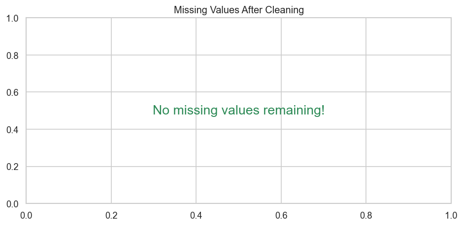

After the full pipeline, **zero missing values** remain in the dataset.

### Cleaned Numeric Distributions

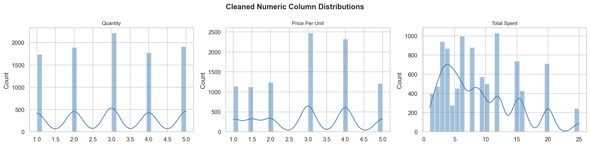

- **Quantity**: roughly uniform across 1–5 (integer peaks)
- **Price Per Unit**: discrete prices \$1–\$5, with \$3 and \$4 most frequent
- **Total Spent**: multi-modal distribution reflecting the product of quantity and price, ranging from \$1 to \$25

### Item Performance

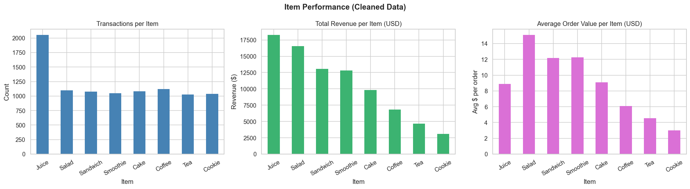

- **Juice** leads in both transaction count (~2,000) and total revenue (~\$18,000), partly boosted by mode imputation
- **Salad** and **Sandwich** are the next top performers by revenue, driven by higher average order values (~\$12–\$15)
- **Cookie** and **Tea** generate the least revenue due to lower unit prices

### Behavioural Patterns

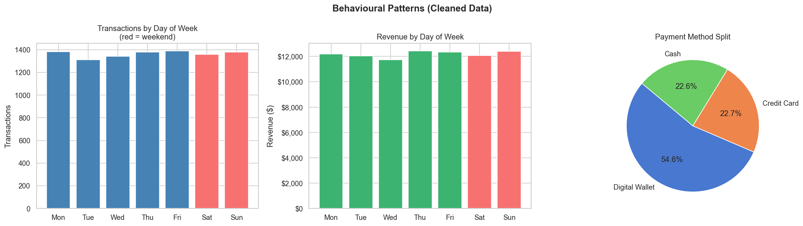

- Transaction volume is **evenly distributed across days of the week** — no strong weekday vs. weekend effect
- **Digital Wallet** dominates payment methods at 54.6 %, followed by Credit Card (22.7 %) and Cash (22.6 %). The high Digital Wallet share is partly due to mode imputation filling ~32 % of missing payment values

### Time-of-Day Patterns

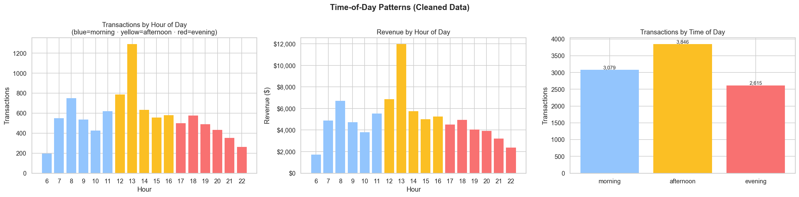

- The **lunch rush (12:00–14:00)** is the clear peak, with hour 13 reaching ~1,300 transactions and ~\$12,000 in revenue
- **Morning** (6–11) accounts for ~3,079 transactions, **afternoon** (12–16) for ~3,846, and **evening** (17–22) for ~2,615
- Revenue per hour follows the same pattern, confirming the lunch period as the highest-value time slot

### Revenue Heatmap: Item × Month

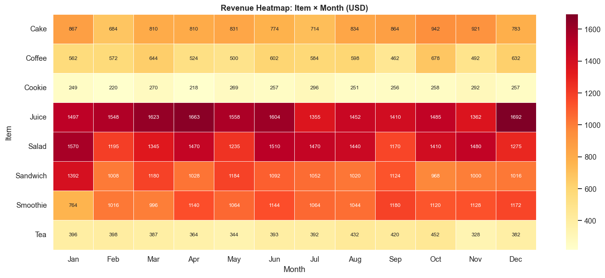

- **Juice** and **Salad** consistently dominate revenue across all 12 months
- Revenue is relatively stable month-to-month — no strong seasonal effect is visible
- **Cookie** and **Tea** remain the lowest earners throughout the year

### Location Breakdown

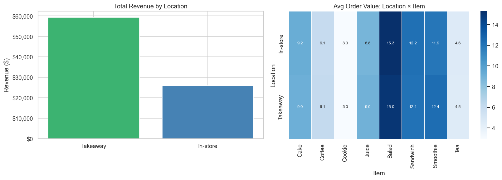

- **Takeaway** accounts for roughly **70 %** of total revenue (~\$59K vs. ~\$25K for In-store). The high Takeaway share is partially a result of mode imputation on the Location column
- Average order values are consistent across locations for the same item — the price structure does not vary by location

---

## 10. Final Output

The cleaned dataset is exported to [`datasets/cafe_sales_cleaned.csv`](../datasets/cafe_sales_cleaned.csv).

### Summary

| Metric           | Value                                        |
| ---------------- | -------------------------------------------- |
| Original rows    | 10,000                                       |
| Cleaned rows     | ~9,540 (rows with unparseable dates dropped) |
| Original columns | 9                                            |
| Final columns    | 21 (9 original + 12 engineered)              |
| Missing values   | **0**                                        |

### Final Column Schema

| Column              | Type      | Origin                  |
| ------------------- | --------- | ----------------------- |
| `Transaction ID`    | string    | original                |
| `Item`              | string    | original (cleaned)      |
| `Quantity`          | float     | original (cleaned)      |
| `Price Per Unit`    | float     | original (cleaned)      |
| `Total Spent`       | float     | original (recalculated) |
| `Payment Method`    | string    | original (cleaned)      |
| `Location`          | string    | original (cleaned)      |
| `Transaction Date`  | datetime  | original (parsed)       |
| `Transaction Time`  | datetime  | original (parsed)       |
| `hour`              | float     | **engineered**          |
| `year`              | int       | **engineered**          |
| `month`             | int       | **engineered**          |
| `day_of_week`       | int       | **engineered**          |
| `is_weekend`        | int (0/1) | **engineered**          |
| `quarter`           | int       | **engineered**          |
| `time_of_day`       | string    | **engineered**          |
| `is_cash`           | int (0/1) | **engineered**          |
| `is_credit_card`    | int (0/1) | **engineered**          |
| `is_digital_wallet` | int (0/1) | **engineered**          |
| `is_takeaway`       | int (0/1) | **engineered**          |

---

> **Note on imputation bias:** Mode imputation on `Payment Method` (→ Digital Wallet) and `Location` (→ Takeaway) inflates the share of those categories. This is a known trade-off — we preserve row count at the cost of slightly distorted categorical distributions. Keep this in mind when interpreting payment or location-specific analyses.
